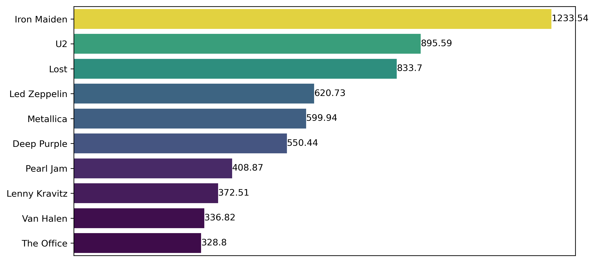

# Chinook SQL to Python Data Pipeline

This project shows how the Chinook music store SQL database was brought into Python, merged, summarized, and visualized. The workflow is simple: import the Chinook database into SQL Server, load the tables into Python using PyKinoos, perform all analysis inside Python, and generate clean revenue dashboards.

---

## Table of Contents
- Introduction  
- Dataset  
- Workflow Summary  
- Analyses Performed  
- Results & Visualizations  
- Project Structure  
- Installation & Usage  
- Contributions  

---

## Introduction

The Chinook SQL to Python Data Pipeline focuses on analyzing the Chinook music store database entirely inside Python. The SQL script was only used to create the database in SQL Server. After that, everything—exploring tables, merging them, calculating revenue summaries, and building dashboards—happened in Python using Jupyter Notebook.

---

## Dataset

This project uses the standard Chinook database, which contains tables such as:

- Artist  
- Album  
- Track  
- Genre  
- MediaType  
- PlaylistTrack  
- Customer  
- Invoice  
- InvoiceLine  
- etc.

The original SQL script was lightly adjusted to work on SQL Server instead of MySQL. After it was created in the server, all further work was done in Python.

---

## Workflow Summary

Below is the exact process used:

### 1. Loaded the Chinook SQL database  
Executed the SQL file in SQL Server. No SQL queries or joins were used for analysis.

### 2. Imported the database into Python using PyKinoos  
Once connected, PyKinoos displayed all tables automatically. Nothing needed to be manually converted.

### 3. Performed light cleaning  
Only very small adjustments were made, such as renaming “total” to “revenue” in some outputs. No heavy cleaning or datatype conversions were needed.

### 4. Merged the tables inside Python  
All relationships were combined using Python merges. This included tracks, artists, genres, invoices, invoice lines, and other tables involved in revenue calculations (etc. included to avoid listing tables incorrectly).

### 5. Created grouped summaries  
Revenue was grouped by:
- Artist  
- Country  
- Genre  
- MediaType  

### 6. Built dashboards with Seaborn and Matplotlib  
This included horizontal bar charts, a pie chart, and a combined dashboard layout.

### 7. Exported high-quality PNG images  
Charts were saved using `plt.savefig(..., dpi=300, bbox_inches="tight")`.

---

## Analyses Performed

The notebook includes:

- Top 10 Countries by Revenue  
- Top 10 Artists by Revenue  
- Top 10 Genres by Revenue  
- Top 3 Media Types by Revenue  

These summaries were generated after merging the required tables.

---

## Results & Visualizations

The exported PNG files include:

- top_artists_revenue.png  
- countries_revenue.png  
- top_genre_revenue.png  
- top_mediatype_revenue.png  

To display images inside GitHub README:

  
  
  

---

## Project Structure

Chinook-SQL-to-Python-Data-Pipeline/  
│  
├── Chinook.sql  
├── Chinook_Analysis.ipynb  
│  
├── top_artists_revenue.png  
├── countries_revenue.png  
├── top_genre_revenue.png  
├── top_mediatype_revenue.png  
│  
└── README.md  

---

## Installation & Usage

### 1. Clone the repository  
git clone https://github.com/Crystabel-Isioma/Chinook-SQL-to-Python-Data-Pipeline.git

### 2. Install required Python libraries  
pip install pandas numpy seaborn matplotlib pykinos

### 3. Open the notebook  
Open Chinook_Analysis.ipynb in Jupyter Notebook or Jupyter Lab.

### 4. Run the analysis  
Running all cells will:
- Import all tables via PyKinoos  
- Merge the necessary tables  
- Create grouped revenue summaries  
- Generate the visual dashboards  
- Save all PNG images  

---

## Contributions

Contributions are welcome.  
You may suggest improvements, add more dashboards, or extend the analysis.
